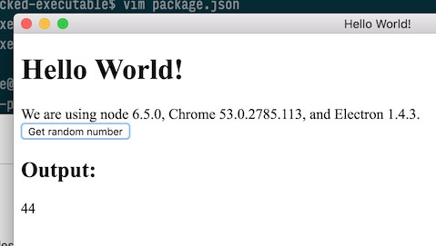
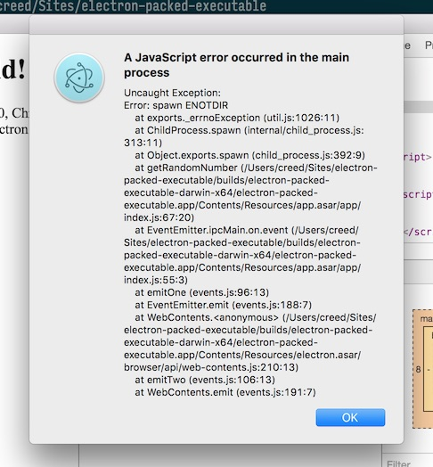

# electron-packed-executable

Test if Electron can fire up packed executables

**tl;dr; Not if they’re asar'd.**

## Setup


  ```shell
  git clone git@github.com:swashcap/electron-packed-executable.git
  cd electron-packed-executable
  npm install
  ```

## Regular Build

1. Build it:

  ```shell
  npm run build
  ```

2. Get a random number:

  

## Asar Build

1. Build it:

  ```shell
  npm run build:asar
  ```

2. Attempt to get a random number:

  

